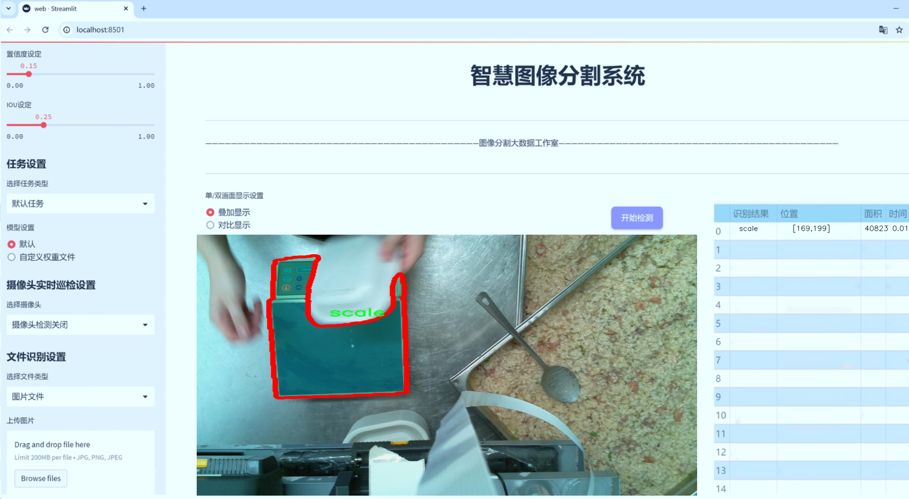
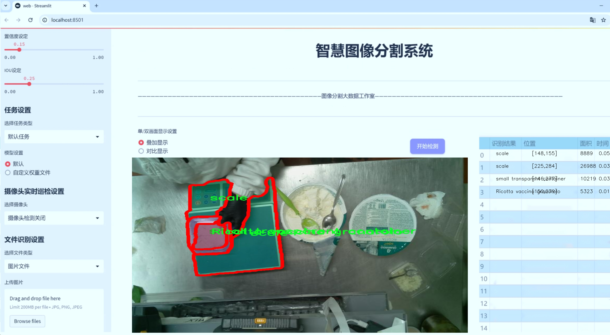
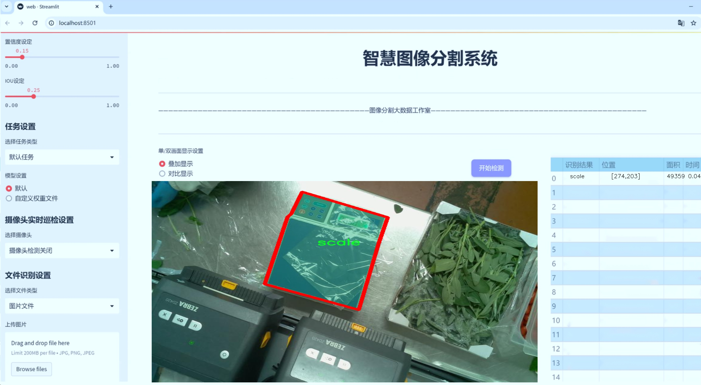
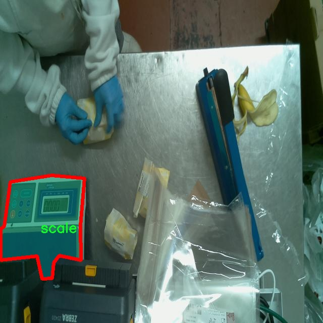
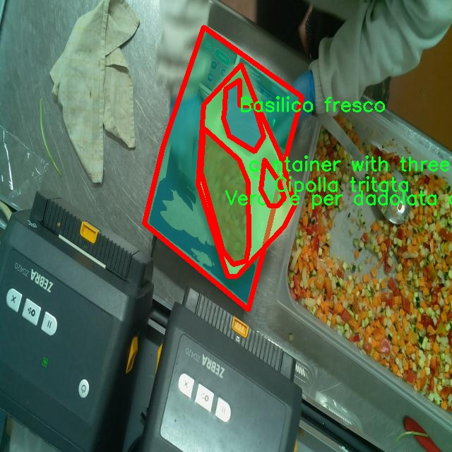
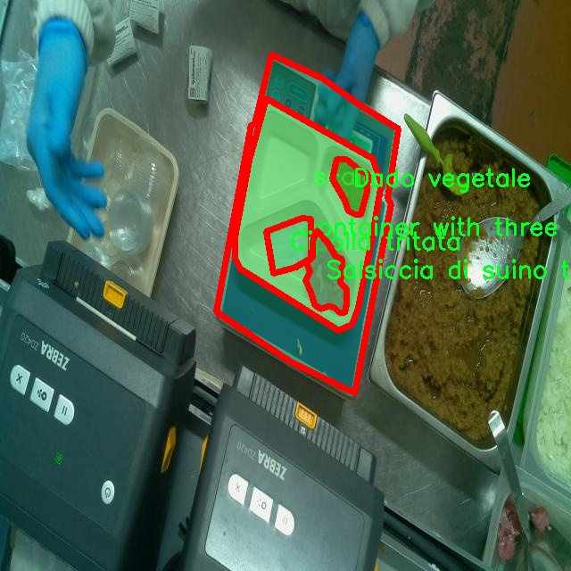
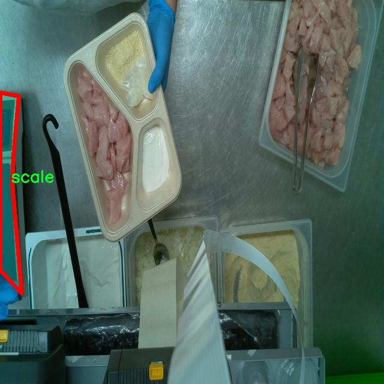
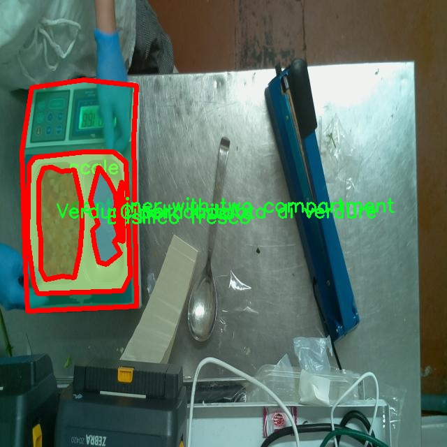

# 智慧电子秤食品图像分割系统源码＆数据集分享
 [yolov8-seg-swintransformer＆yolov8-seg-HGNetV2等50+全套改进创新点发刊_一键训练教程_Web前端展示]

### 1.研究背景与意义

项目参考[ILSVRC ImageNet Large Scale Visual Recognition Challenge](https://gitee.com/YOLOv8_YOLOv11_Segmentation_Studio/projects)

项目来源[AAAI Global Al lnnovation Contest](https://kdocs.cn/l/cszuIiCKVNis)

研究背景与意义

随着科技的迅猛发展，智能设备在日常生活中的应用愈加广泛，尤其是在食品安全和健康管理领域。智慧电子秤作为一种新兴的智能设备，不仅能够精准测量食品的重量，还能够通过图像识别技术提供关于食品的更多信息。近年来，图像分割技术在计算机视觉领域取得了显著进展，尤其是基于深度学习的目标检测与分割算法，如YOLO（You Only Look Once）系列模型，已被广泛应用于各类图像处理任务中。YOLOv8作为该系列的最新版本，具备更高的检测精度和实时性，为食品图像的处理提供了强有力的技术支持。

在食品图像分割的研究中，数据集的构建和标注是至关重要的环节。本研究所使用的数据集“Labeling_v2”包含1600张图像，涵盖了六个类别，包括前电池、前视标签、侧视标签、顶电池、顶视类型和顶视标签。这些类别的设置不仅反映了食品包装的多样性，也为图像分割模型的训练提供了丰富的样本。通过对这些图像进行实例分割，可以实现对食品包装上各个信息的精准提取，从而为消费者提供更为详尽的食品信息，增强食品安全性和透明度。

改进YOLOv8模型的应用，将为智慧电子秤的食品图像分割系统带来显著的技术优势。传统的图像处理方法往往依赖于手工特征提取，难以适应复杂多变的食品图像特征。而YOLOv8模型通过深度学习技术，能够自动学习图像中的特征，具备更强的适应性和鲁棒性。通过对YOLOv8模型的改进，可以进一步提升其在特定应用场景下的性能，例如针对食品图像的特殊背景、光照变化等情况进行优化，使其在实际应用中表现更加出色。

本研究的意义不仅在于技术层面的创新，更在于其对食品安全和健康管理的深远影响。随着消费者对食品安全意识的提升，智慧电子秤的应用将为消费者提供更加直观和可靠的食品信息，帮助他们做出更为科学的饮食选择。此外，基于改进YOLOv8的图像分割系统，还可以为食品行业提供数据支持，帮助企业优化产品包装设计和市场营销策略，从而提升竞争力。

综上所述，基于改进YOLOv8的智慧电子秤食品图像分割系统的研究，不仅具有重要的学术价值，也具备广泛的应用前景。通过对图像分割技术的深入探索，能够推动智能设备在食品安全领域的进一步发展，为实现健康饮食和食品安全提供有力的技术保障。

### 2.图片演示







##### 注意：由于此博客编辑较早，上面“2.图片演示”和“3.视频演示”展示的系统图片或者视频可能为老版本，新版本在老版本的基础上升级如下：（实际效果以升级的新版本为准）

  （1）适配了YOLOV8的“目标检测”模型和“实例分割”模型，通过加载相应的权重（.pt）文件即可自适应加载模型。

  （2）支持“图片识别”、“视频识别”、“摄像头实时识别”三种识别模式。

  （3）支持“图片识别”、“视频识别”、“摄像头实时识别”三种识别结果保存导出，解决手动导出（容易卡顿出现爆内存）存在的问题，识别完自动保存结果并导出到tempDir中。

  （4）支持Web前端系统中的标题、背景图等自定义修改，后面提供修改教程。

  另外本项目提供训练的数据集和训练教程,暂不提供权重文件（best.pt）,需要您按照教程进行训练后实现图片演示和Web前端界面演示的效果。

### 3.视频演示

[3.1 视频演示](https://www.bilibili.com/video/BV1LRyoYBEq1/)

### 4.数据集信息展示

##### 4.1 本项目数据集详细数据（类别数＆类别名）

nc: 146
names: ['-Mozzarella julienne', 'Acciughe in olio di girasole', 'Aglio a fette', 'Ananas tagliato', 'Bacon', 'Basilico fresco', 'Besciamella artigianale', 'Bocconcini  di pollo', 'Bocconcini di pane integrale', 'Capperi e olive taggiasche', 'Capperi lacrimella in aceto', 'Carote e fagiolini', 'Cavolo cappuccio rosso julienne', 'Ceci bio cotti', 'Cipolla affettata', 'Cipolla rossa affettata', 'Cipolla tritata', 'Code gambero argentino', 'Cubetti di caciocavallo dop Silano', 'Cubetti di cuore di merluzzo nordico', 'Dadini di brasato', 'Dado vegetale', 'Dischetti cioccolato fondente extra', 'Fagiolini cotti', 'Feta cubettata', 'Fettina di pesce spada fresco', 'Fettina di tonno pinne gialle', 'Fettine di caciocavallo dop Silano', 'Filetto di branzino al forno', 'Filetto di trota salmonata', 'Formaggio erborinato dolce', 'Formaggio spalmabile', 'Funghi Champignon crema affettati', 'Gnocchi di patate', 'Gorgonzola dop cubetti', 'Gran Milano Bio', 'Granella di mandorle', 'Gratinatura mare', 'Guanciale cubettato', 'Hummus', 'Insalata Songino', 'Insalata di gamberoni argentini alla mediterranea', 'Insalata mista', 'Insalata novella', 'Insalatona con mozzarella e tonno', 'Latte Esl Granarolo', 'Mazzancolla tropicale decongelata', 'Melanzane grigliate', 'Mix per torta salata', 'Mozzarella  Fiordilatte', 'Mozzarella con latte di B a fette', 'Mozzarella julienne', 'Mozzarella senza lattosio', 'Olive taggiasche', 'Olive verdi a rondelle', 'Olive verdi giganti', 'Pane grattugiato', 'Panna da cucina  per ricette', 'Passata di pomodoro', 'Pasta al pomodoro', 'Pasta corta', 'Pasta corta integrale', 'Pasta di salsiccia', 'Pasta integrale', 'Patate cubettate small', 'Patate prezzemolate', 'Pecorino romano grattugiato', 'Peperoni cotti al forno senza pelle', 'Peperoni tagliati a filetti', 'Pepite di formaggio Gran Milano Bio', 'Pepite di formaggio stagionato', 'Pesto artigianale', 'Pesto basilico fresco', 'Pisarei', 'Piselli cotti', 'Piselli cotti-', 'Polpa di merluzzo nordico tritato', 'Pomodori ciliegini', 'Pomodori datterini', 'Pomodori datterini rondelle', 'Pomodori secchi', 'Porro a rondelle', 'Prezzemolo fresco', 'Prosciutto cotto', 'Prosciutto cotto cubettato', 'Puntarelle', 'Radicchio rosso julienne', 'Ravioli di brasato', 'Ravioli freschi ricotta e spinaci', 'Ricotta fresca di latte', 'Ricotta vaccina granarolo', 'Riso basmati cotto', 'Riso basmati lesso', 'Riso lesso', 'Risotto ai frutti di mare', 'Rosmarino fresco', 'Rucola', 'Salamino a  fette', 'Salmone affumicato julienne', 'Salmone fresco cubettato', 'Salsa di noci artigianale', 'Salsa di pomodoro artigianale pronta', 'Salsiccia di suino tagliata', 'Salvia fresca', 'Scaglie di formaggio', 'Scamorza affumicata cubettata', 'Sedano rapa cubetti', 'Speck julienne', 'Spiedino di gambero argentino', 'Spinaci freschi mondati', 'Spinacino fresco lavato', 'Stracchino', 'Stracciatella  fresca artigianale', 'Stracciatella Artigianale', 'Timo fresco', 'Tonno in olio di semi di girasole', 'Trancio di baffa di salmone', 'Trofie fresche', 'Verdure cubettate', 'Verdure cubettate per ortolana', 'Verdure e germogli di soia', 'Verdure per dadolata di verdure', 'Vongole veraci', 'Yogurt Yomo intero bianco', 'Zucca cubettata small', 'Zucca petali', 'Zucchine a fette per griglia', 'Zucchine cubettate', 'Zucchine fiammifero', 'Zucchine mezza luna', 'Zucchine mezza luna sottili', 'Zuppa di ceci patate e  biete', 'big single container', 'big transparent container', 'carne', 'container with three compartment', 'container with two compartment', 'cup container', 'erbette verdi fresche mondate', 'medium transparent container', 'paper package', 'polpette', 'scale', 'single container', 'single container long', 'small transparent container']


##### 4.2 本项目数据集信息介绍

数据集信息展示

在本研究中，我们使用了名为“Labeling_v2”的数据集，以训练和改进YOLOv8-seg模型，旨在开发一个高效的智慧电子秤食品图像分割系统。该数据集包含146个类别，涵盖了多种食品和容器类型，能够为图像分割任务提供丰富的样本和多样化的特征。这些类别不仅包括各种食材，还涉及到不同类型的容器，为模型的训练提供了全面的视角，确保其在实际应用中的有效性和准确性。

在食品类别方面，数据集涵盖了从新鲜蔬菜到加工食品的广泛选择。例如，数据集中包括了多种奶酪（如Mozzarella julienne、Gorgonzola dop cubetti等）、肉类（如Bacon、Prosciutto cotto等）、海鲜（如Fettina di pesce spada fresco、Salmone affumicato julienne等）以及多种新鲜蔬菜（如Zucchine a fette per griglia、Spinaci freschi mondati等）。这种多样性使得模型能够学习到不同食品的特征，进而提高其在图像分割任务中的表现。

此外，数据集中还包含了多种调味品和配料，如Pesto artigianale、Salsa di pomodoro artigianale pronta等，这些成分在现代烹饪中扮演着重要角色。通过对这些类别的学习，模型不仅能够识别单一的食品，还能理解不同食品之间的组合和搭配，从而为用户提供更智能的服务。

在容器类别方面，数据集同样丰富多样，涵盖了从大透明容器到单个容器的多种类型。这些容器的多样性为模型提供了额外的挑战，因为不同的容器形状和材质可能会影响食品的外观和分割效果。通过训练模型识别这些容器，系统能够在实际应用中更好地处理不同包装的食品，提升用户体验。

总的来说，“Labeling_v2”数据集的多样性和丰富性为改进YOLOv8-seg模型提供了坚实的基础。通过对146个类别的深入学习，模型能够在食品图像分割任务中表现出色，帮助实现更智能的电子秤系统。该系统不仅能够提高食品识别的准确性，还能为用户提供个性化的饮食建议，促进健康饮食的实现。未来，我们将继续优化模型，进一步提升其在复杂场景下的表现，以满足不断变化的市场需求和用户期望。











### 5.全套项目环境部署视频教程（零基础手把手教学）

[5.1 环境部署教程链接（零基础手把手教学）](https://www.bilibili.com/video/BV1jG4Ve4E9t/?vd_source=bc9aec86d164b67a7004b996143742dc)


[5.2 安装Python虚拟环境创建和依赖库安装视频教程链接（零基础手把手教学）](https://www.bilibili.com/video/BV1nA4VeYEze/?vd_source=bc9aec86d164b67a7004b996143742dc)

### 6.手把手YOLOV8-seg训练视频教程（零基础小白有手就能学会）

[6.1 手把手YOLOV8-seg训练视频教程（零基础小白有手就能学会）](https://www.bilibili.com/video/BV1cA4VeYETe/?vd_source=bc9aec86d164b67a7004b996143742dc)


按照上面的训练视频教程链接加载项目提供的数据集，运行train.py即可开始训练



     Epoch   gpu_mem       box       obj       cls    labels  img_size
     1/200     0G   0.01576   0.01955  0.007536        22      1280: 100%|██████████| 849/849 [14:42<00:00,  1.04s/it]
               Class     Images     Labels          P          R     mAP@.5 mAP@.5:.95: 100%|██████████| 213/213 [01:14<00:00,  2.87it/s]
                 all       3395      17314      0.994      0.957      0.0957      0.0843

     Epoch   gpu_mem       box       obj       cls    labels  img_size
     2/200     0G   0.01578   0.01923  0.007006        22      1280: 100%|██████████| 849/849 [14:44<00:00,  1.04s/it]
               Class     Images     Labels          P          R     mAP@.5 mAP@.5:.95: 100%|██████████| 213/213 [01:12<00:00,  2.95it/s]
                 all       3395      17314      0.996      0.956      0.0957      0.0845

     Epoch   gpu_mem       box       obj       cls    labels  img_size
     3/200     0G   0.01561    0.0191  0.006895        27      1280: 100%|██████████| 849/849 [10:56<00:00,  1.29it/s]
               Class     Images     Labels          P          R     mAP@.5 mAP@.5:.95: 100%|███████   | 187/213 [00:52<00:00,  4.04it/s]
                 all       3395      17314      0.996      0.957      0.0957      0.0845


### 7.50+种全套YOLOV8-seg创新点代码加载调参视频教程（一键加载写好的改进模型的配置文件）

[7.1 50+种全套YOLOV8-seg创新点代码加载调参视频教程（一键加载写好的改进模型的配置文件）](https://www.bilibili.com/video/BV1Hw4VePEXv/?vd_source=bc9aec86d164b67a7004b996143742dc)

### 8.YOLOV8-seg图像分割算法原理

原始YOLOv8-seg算法原理

YOLOv8-seg算法是YOLO系列模型的最新进展，结合了目标检测和图像分割的功能，旨在提供更高效和准确的视觉识别能力。该算法的核心在于其网络结构的设计与优化，主要由Backbone、Neck和Head三部分组成，充分利用了深度学习技术的优势，以实现对复杂场景中目标的精确识别和分割。

在特征提取阶段，YOLOv8-seg采用了CSPDarknet作为主干网络。CSPDarknet通过将网络分为两个部分并引入多个残差块，增强了特征提取的能力。与之前的YOLOv5模型相比，YOLOv8-seg引入了C2f模块，这一模块的设计灵感来源于YOLOv7中的ELAN结构。C2f模块通过将输入特征图分为两个分支，分别经过卷积层进行降维处理，从而形成更高维度的特征图。这种设计不仅提高了模型的梯度流信息，还在一定程度上减轻了计算负担，提升了特征提取的效率。

在特征金字塔网络（FPN）和路径聚合网络（PAN）的结合下，YOLOv8-seg能够有效处理多尺度特征。通过快速空间金字塔池化（SPPF）结构，模型能够提取不同尺度的特征，同时减少参数量和计算量。这种高效的特征提取方式使得YOLOv8-seg在处理复杂背景和不同尺寸目标时，能够保持较高的准确性和速度。

YOLOv8-seg在目标检测部分采用了无锚框（Anchor-Free）的方法，这一创新使得模型能够直接预测目标的中心点和宽高比例。通过这种方式，YOLOv8-seg显著减少了Anchor框的数量，从而提高了检测速度和准确度。此外，模型还引入了任务对齐学习（Task Alignment Learning, TAL）机制，以优化分类和定位任务的协同工作。TAL通过引入分类分数和IOU的高次幂乘积作为衡量指标，确保了分类和定位的有效对齐，从而提升了整体性能。

在YOLOv8-seg的Head部分，采用了解耦头的设计理念，将类别和位置特征的提取分为两个并行的分支。这种结构使得模型在处理分类和定位任务时，能够更专注于各自的特征，从而提高了收敛速度和预测精度。分类任务侧重于分析特征图中提取到的特征与已有类别的相似度，而定位任务则关注边界框与真实框的位置关系。这种分离的设计理念在一定程度上克服了传统方法中分类和定位任务相互干扰的问题，提升了模型的整体性能。

YOLOv8-seg的训练过程中，针对数据增强的策略也进行了优化。尽管Mosaic数据增强能够提升模型的鲁棒性和泛化能力，但在训练的最后阶段，YOLOv8-seg选择停止使用该方法，以避免对数据真实分布的干扰。这一策略的实施使得模型在面对真实场景时，能够更好地适应和学习。

在模型的性能方面，YOLOv8-seg在多个公开数据集上进行了验证，尤其是在COCO数据集上，表现出色。通过对比其他YOLO系列模型，YOLOv8-seg在相同尺寸下实现了更高的精度和更快的推理速度。这一优势使得YOLOv8-seg在实时目标检测和分割任务中，成为一个极具竞争力的选择。

总的来说，YOLOv8-seg算法通过对网络结构的创新设计和训练策略的优化，成功地将目标检测与图像分割结合在一起，展现了出色的性能和广泛的应用潜力。其无锚框的检测方式、任务对齐学习机制以及高效的特征提取能力，使得YOLOv8-seg在复杂场景下的目标识别和分割任务中，具备了更高的准确性和速度，为未来的研究和应用提供了新的方向。随着YOLOv8-seg的不断发展和完善，预计将在自动驾驶、智能监控、机器人视觉等领域发挥更为重要的作用。


### 9.系统功能展示（检测对象为举例，实际内容以本项目数据集为准）

图9.1.系统支持检测结果表格显示

  图9.2.系统支持置信度和IOU阈值手动调节

  图9.3.系统支持自定义加载权重文件best.pt(需要你通过步骤5中训练获得)

  图9.4.系统支持摄像头实时识别

  图9.5.系统支持图片识别

  图9.6.系统支持视频识别

  图9.7.系统支持识别结果文件自动保存

  图9.8.系统支持Excel导出检测结果数据


### 10.50+种全套YOLOV8-seg创新点原理讲解（非科班也可以轻松写刊发刊，V11版本正在科研待更新）

#### 10.1 由于篇幅限制，每个创新点的具体原理讲解就不一一展开，具体见下列网址中的创新点对应子项目的技术原理博客网址【Blog】：


[10.1 50+种全套YOLOV8-seg创新点原理讲解链接](https://gitee.com/qunmasj/good)

#### 10.2 部分改进模块原理讲解(完整的改进原理见上图和技术博客链接)【如果此小节的图加载失败可以通过CSDN或者Github搜索该博客的标题访问原始博客，原始博客图片显示正常】
### YOLOv8算法原理
YOLOv8算法由Glenn-Jocher 提出，是跟YOLOv3算法、YOLOv5算法一脉相承的，主要的改进点如下:
(1)数据预处理。YOLOv8的数据预处理依旧采用YOLOv5的策略,在训练时，主要采用包括马赛克增强(Mosaic)、混合增强(Mixup)、空间扰动(randomperspective)以及颜色扰动(HSV augment)四个增强手段。
(2)骨干网络结构。YOLOv8的骨干网络结构可从YOLOv5略见一斑，YOLOv5的主干网络的架构规律十分清晰，总体来看就是每用一层步长为2的3×3卷积去降采样特征图，接一个C3模块来进一步强化其中的特征，且C3的基本深度参数分别为“3/6/9/3”，其会根据不同规模的模型的来做相应的缩放。在的YOLOv8中，大体上也还是继承了这一特点，原先的C3模块均被替换成了新的C2f模块，C2f 模块加入更多的分支，丰富梯度回传时的支流。下面展示了YOLOv8的C2f模块和YOLOv5的C3模块，其网络结构图所示。


(3)FPN-PAN结构。YOLOv8仍采用FPN+PAN结构来构建YOLO的特征金字塔，使多尺度信息之间进行充分的融合。除了FPN-PAN里面的C3模块被替换为C2f模块外，其余部分与YOLOv5的FPN-PAN结构基本一致。
(4)Detection head结构。从 YOLOv3到 YOLOv5，其检测头一直都是“耦合”(Coupled)的,即使用一层卷积同时完成分类和定位两个任务，直到YOLOX的问世， YOLO系列才第一次换装“解耦头”(Decoupled Head)。YOLOv8也同样也采用了解耦头的结构，两条并行的分支分别取提取类别特征和位置特征，然后各用一层1x1卷积完成分类和定位任务。YOLOv8整体的网络结构由图所示。


(5)标签分配策略。尽管YOLOv5设计了自动聚类候选框的一些功能，但是聚类候选框是依赖于数据集的。若数据集不够充分，无法较为准确地反映数据本身的分布特征，聚类出来的候选框也会与真实物体尺寸比例悬殊过大。YOLOv8没有采用候选框策略，所以解决的问题就是正负样本匹配的多尺度分配。不同于YOLOX所使用的 SimOTA，YOLOv8在标签分配问题上采用了和YOLOv6相同的TOOD策略，是一种动态标签分配策略。YOLOv8只用到了targetboze。和target scores，未含是否有物体预测，故 YOLOv8的损失就主要包括两大部分∶类别损失和位置损失。对于YOLOv8，其分类损失为VFLLoss(Varifocal Loss)，其回归损失为CIoU Loss 与 DFL Loss 的形式。
其中 Varifocal Loss定义如下:


其中p为预测的类别得分，p ∈ [0.1]。q为预测的目标分数(若为真实类别，则q为预测和真值的 loU;若为其他类别。q为0 )。VFL Loss使用不对称参数来对正负样本进行加权，通过只对负样本进行衰减，达到不对等的处理前景和背景对损失的贡献。对正样本，使用q进行了加权，如果正样本的GTiou很高时,则对损失的贡献更大一些，可以让网络聚焦于那些高质量的样本上，即训练高质量的正例对AP的提升比低质量的更大一些。对负样本，使用p进行了降权，降低了负例对损失的贡献，因负样本的预测p在取次幂后会变得更小，这样就能够降低负样本对损失的整体贡献。

### 动态蛇形卷积Dynamic Snake Convolution

参考论文： 2307.08388.pdf (arxiv.org)

血管、道路等拓扑管状结构的精确分割在各个领域都至关重要，确保下游任务的准确性和效率。 然而，许多因素使任务变得复杂，包括薄的局部结构和可变的全局形态。在这项工作中，我们注意到管状结构的特殊性，并利用这些知识来指导我们的 DSCNet 在三个阶段同时增强感知：特征提取、特征融合、 和损失约束。 首先，我们提出了一种动态蛇卷积，通过自适应地关注细长和曲折的局部结构来准确捕获管状结构的特征。 随后，我们提出了一种多视图特征融合策略，以补充特征融合过程中多角度对特征的关注，确保保留来自不同全局形态的重要信息。 最后，提出了一种基于持久同源性的连续性约束损失函数，以更好地约束分割的拓扑连续性。 2D 和 3D 数据集上的实验表明，与多种方法相比，我们的 DSCNet 在管状结构分割任务上提供了更好的准确性和连续性。 我们的代码是公开的。 
主要的挑战源于细长微弱的局部结构特征与复杂多变的全局形态特征。本文关注到管状结构细长连续的特点，并利用这一信息在神经网络以下三个阶段同时增强感知：特征提取、特征融合和损失约束。分别设计了动态蛇形卷积（Dynamic Snake Convolution），多视角特征融合策略与连续性拓扑约束损失。 

我们希望卷积核一方面能够自由地贴合结构学习特征，另一方面能够在约束条件下不偏离目标结构太远。在观察管状结构的细长连续的特征后，脑海里想到了一个动物——蛇。我们希望卷积核能够像蛇一样动态地扭动，来贴合目标的结构。

我们希望卷积核一方面能够自由地贴合结构学习特征，另一方面能够在约束条件下不偏离目标结构太远。在观察管状结构的细长连续的特征后，脑海里想到了一个动物——蛇。我们希望卷积核能够像蛇一样动态地扭动，来贴合目标的结构。


### DCNV2融入YOLOv8
DCN和DCNv2（可变性卷积）
网上关于两篇文章的详细描述已经很多了，我这里具体的细节就不多讲了，只说一下其中实现起来比较困惑的点。（黑体字会讲解）

DCNv1解决的问题就是我们常规的图像增强，仿射变换（线性变换加平移）不能解决的多种形式目标变换的几何变换的问题。如下图所示。

可变性卷积的思想很简单，就是讲原来固定形状的卷积核变成可变的。如下图所示：


首先来看普通卷积，以3x3卷积为例对于每个输出y(p0)，都要从x上采样9个位置，这9个位置都在中心位置x(p0)向四周扩散得到的gird形状上，(-1,-1)代表x(p0)的左上角，(1,1)代表x(p0)的右下角，其他类似。

用公式表示如下：


可变性卷积Deformable Conv操作并没有改变卷积的计算操作，而是在卷积操作的作用区域上，加入了一个可学习的参数∆pn。同样对于每个输出y(p0)，都要从x上采样9个位置，这9个位置是中心位置x(p0)向四周扩散得到的，但是多了 ∆pn，允许采样点扩散成非gird形状。


偏移量是通过对原始特征层进行卷积得到的。比如输入特征层是w×h×c，先对输入的特征层进行卷积操作，得到w×h×2c的offset field。这里的w和h和原始特征层的w和h是一致的，offset field里面的值是输入特征层对应位置的偏移量，偏移量有x和y两个方向，所以offset field的channel数是2c。offset field里的偏移量是卷积得到的，可能是浮点数，所以接下来需要通过双向性插值计算偏移位置的特征值。在偏移量的学习中，梯度是通过双线性插值来进行反向传播的。
看到这里是不是还是有点迷茫呢？那到底程序上面怎么实现呢？


事实上由上面的公式我们可以看得出来∆pn这个偏移量是加在原像素点上的，但是我们怎么样从代码上对原像素点加这个量呢？其实很简单，就是用一个普通的卷积核去跟输入图片（一般是输入的feature_map）卷积就可以了卷积核的数量是2N也就是23*3==18（前9个通道是x方向的偏移量，后9个是y方向的偏移量），然后把这个卷积的结果与正常卷积的结果进行相加就可以了。
然后又有了第二个问题，怎么样反向传播呢？为什么会有这个问题呢？因为求出来的偏移量+正常卷积输出的结果往往是一个浮点数，浮点数是无法对应到原图的像素点的，所以自然就想到了双线性差值的方法求出浮点数对应的浮点像素点。


#### DCN v2
对于positive的样本来说，采样的特征应该focus在RoI内，如果特征中包含了过多超出RoI的内容，那么结果会受到影响和干扰。而negative样本则恰恰相反，引入一些超出RoI的特征有助于帮助网络判别这个区域是背景区域。

DCNv1引入了可变形卷积，能更好的适应目标的几何变换。但是v1可视化结果显示其感受野对应位置超出了目标范围，导致特征不受图像内容影响（理想情况是所有的对应位置分布在目标范围以内）。

为了解决该问题：提出v2, 主要有

1、扩展可变形卷积，增强建模能力
2、提出了特征模拟方案指导网络培训：feature mimicking scheme

上面这段话是什么意思呢，通俗来讲就是，我们的可变性卷积的区域大于目标所在区域，所以这时候就会对非目标区域进行错误识别。

所以自然能想到的解决方案就是加入权重项进行惩罚。（至于这个实现起来就比较简单了，直接初始化一个权重然后乘(input+offsets)就可以了）


可调节的RoIpooling也是类似的，公式如下：


### 11.项目核心源码讲解（再也不用担心看不懂代码逻辑）

#### 11.1 demo_test_video.py

以下是对代码的逐文件分析和核心部分的保留，并添加了详细的中文注释：

```python
import random
import cv2
import numpy as np
from PIL import ImageFont, ImageDraw, Image
from hashlib import md5
from model import Web_Detector
from chinese_name_list import Label_list

def generate_color_based_on_name(name):
    # 使用哈希函数生成稳定的颜色
    hash_object = md5(name.encode())  # 对名字进行MD5哈希
    hex_color = hash_object.hexdigest()[:6]  # 取前6位16进制数作为颜色值
    r, g, b = int(hex_color[0:2], 16), int(hex_color[2:4], 16), int(hex_color[4:6], 16)  # 转换为RGB
    return (b, g, r)  # OpenCV 使用BGR格式

def draw_with_chinese(image, text, position, font_size=20, color=(255, 0, 0)):
    # 在图像上绘制中文文本
    image_pil = Image.fromarray(cv2.cvtColor(image, cv2.COLOR_BGR2RGB))  # 转换为PIL格式
    draw = ImageDraw.Draw(image_pil)  # 创建绘图对象
    font = ImageFont.truetype("simsun.ttc", font_size, encoding="unic")  # 加载中文字体
    draw.text(position, text, font=font, fill=color)  # 绘制文本
    return cv2.cvtColor(np.array(image_pil), cv2.COLOR_RGB2BGR)  # 转换回OpenCV格式

def draw_detections(image, info):
    # 绘制检测结果，包括边框、类别名称等
    name, bbox = info['class_name'], info['bbox']  # 获取类别名称和边界框
    x1, y1, x2, y2 = bbox  # 解包边界框坐标
    cv2.rectangle(image, (x1, y1), (x2, y2), color=(0, 0, 255), thickness=3)  # 绘制边界框
    image = draw_with_chinese(image, name, (x1, y1 - 10), font_size=20)  # 绘制类别名称
    return image

def process_frame(model, image):
    # 处理每一帧图像
    pre_img = model.preprocess(image)  # 预处理图像
    pred = model.predict(pre_img)  # 进行预测
    det = pred[0]  # 获取检测结果

    if det is not None and len(det):
        det_info = model.postprocess(pred)  # 后处理，获取检测信息
        for info in det_info:
            image = draw_detections(image, info)  # 绘制检测结果
    return image

if __name__ == "__main__":
    model = Web_Detector()  # 创建模型实例
    model.load_model("./weights/yolov8s-seg.pt")  # 加载模型权重

    # 视频处理
    video_path = ''  # 输入视频路径
    cap = cv2.VideoCapture(video_path)  # 打开视频文件
    while cap.isOpened():
        ret, frame = cap.read()  # 逐帧读取视频
        if not ret:
            break
        processed_frame = process_frame(model, frame)  # 处理当前帧
        cv2.imshow('Processed Video', processed_frame)  # 显示处理后的帧
        if cv2.waitKey(1) & 0xFF == ord('q'):  # 按'q'退出
            break
    cap.release()  # 释放视频捕获对象
    cv2.destroyAllWindows()  # 关闭所有OpenCV窗口
```

### 核心部分说明：
1. **生成颜色**：`generate_color_based_on_name` 函数通过对名称进行哈希处理生成稳定的颜色值，确保相同的名称总是生成相同的颜色。
2. **绘制中文文本**：`draw_with_chinese` 函数使用PIL库在图像上绘制中文文本，支持中文字体。
3. **绘制检测结果**：`draw_detections` 函数负责在图像上绘制检测到的物体的边界框和类别名称。
4. **处理视频帧**：`process_frame` 函数将模型应用于每一帧图像，进行检测并绘制结果。
5. **主程序**：在主程序中，加载模型并逐帧处理视频，实时显示处理结果。

这个程序文件 `demo_test_video.py` 是一个用于视频处理的脚本，主要功能是使用深度学习模型进行目标检测和分割，并在视频帧上绘制检测结果。程序的主要流程和功能如下：

首先，程序导入了一些必要的库，包括 `random`、`cv2`（OpenCV）、`numpy`、`PIL`（用于处理图像的库）、`hashlib`（用于生成哈希值）以及自定义的 `Web_Detector` 模型和 `Label_list` 类别标签。

接下来，定义了几个辅助函数。`generate_color_based_on_name` 函数根据输入的名称生成一个稳定的颜色，使用 MD5 哈希函数来确保同一个名称总是生成相同的颜色，返回值为 BGR 格式的颜色元组。`calculate_polygon_area` 函数用于计算给定点集的多边形面积，使用 OpenCV 的 `contourArea` 方法。

`draw_with_chinese` 函数用于在图像上绘制中文文本，使用 PIL 库将 OpenCV 图像转换为 PIL 图像，然后在指定位置绘制文本，最后再转换回 OpenCV 格式。`adjust_parameter` 函数根据图像的大小调整参数，以便在不同分辨率的图像上保持一致的绘制效果。

`draw_detections` 函数是核心功能之一，负责在图像上绘制检测到的目标。它根据检测信息（如类别名称、边界框、置信度、类别 ID 和掩膜）来绘制矩形框或多边形，并在图像上添加类别名称及其相关的几何特征（如面积、周长、圆度和颜色）。如果存在掩膜，则使用多边形绘制目标区域，并计算相关的几何特征。

`process_frame` 函数用于处理每一帧图像。它首先对图像进行预处理，然后通过模型进行预测，得到检测结果。如果检测到目标，则调用 `draw_detections` 函数在图像上绘制检测结果。

在 `__main__` 部分，程序首先加载类别标签和深度学习模型。然后打开视频文件并逐帧读取视频，调用 `process_frame` 函数处理每一帧，并通过 OpenCV 显示处理后的结果。如果用户按下 'q' 键，程序将退出。

总体来说，这个程序实现了一个基于深度学习的实时视频目标检测和分割的功能，通过绘制检测结果和相关信息，提供了可视化的反馈。

#### 11.2 ultralytics\models\rtdetr\__init__.py

以下是代码中最核心的部分，并附上详细的中文注释：

```python
# 导入RTDETR模型、预测器和验证器
from .model import RTDETR  # 导入RTDETR模型类
from .predict import RTDETRPredictor  # 导入RTDETR预测器类
from .val import RTDETRValidator  # 导入RTDETR验证器类

# 定义模块的公开接口，指定可以被外部访问的类
__all__ = 'RTDETRPredictor', 'RTDETRValidator', 'RTDETR'  # 公开RTDETR预测器、验证器和模型
```

### 注释说明：
1. **导入模块**：
   - `from .model import RTDETR`：从当前包的`model`模块中导入`RTDETR`类，`RTDETR`是一个模型类，负责定义和构建目标检测模型。
   - `from .predict import RTDETRPredictor`：从当前包的`predict`模块中导入`RTDETRPredictor`类，`RTDETRPredictor`用于执行模型的预测功能。
   - `from .val import RTDETRValidator`：从当前包的`val`模块中导入`RTDETRValidator`类，`RTDETRValidator`用于对模型进行验证和评估。

2. **定义公开接口**：
   - `__all__`：这是一个特殊变量，用于定义模块的公开接口。它包含一个字符串元组，指定了哪些类可以被外部导入。在这里，`RTDETRPredictor`、`RTDETRValidator`和`RTDETR`都是可以被外部访问的类。

这个程序文件是Ultralytics YOLO项目中的一个模块初始化文件，位于`ultralytics\models\rtdetr`目录下。文件的主要功能是导入该模块中的相关类，并定义了模块的公共接口。

首先，文件开头有一行注释，表明该项目是Ultralytics YOLO，并且遵循AGPL-3.0许可证。这是一个开源许可证，允许用户自由使用、修改和分发软件，但要求在分发时保持相同的许可证。

接下来，文件通过相对导入的方式引入了三个类：`RTDETR`、`RTDETRPredictor`和`RTDETRValidator`。这些类分别定义在同一模块的不同文件中，具体来说：

- `RTDETR`：可能是一个模型类，负责定义和实现RTDETR（Real-Time DEtection TRansformer）模型的结构和功能。
- `RTDETRPredictor`：这个类很可能用于处理模型的预测功能，即使用训练好的RTDETR模型对输入数据进行推断。
- `RTDETRValidator`：这个类可能用于模型的验证过程，评估模型在验证集上的表现。

最后，`__all__`变量被定义为一个元组，包含了上述三个类的名称。这意味着当使用`from ultralytics.models.rtdetr import *`这样的语句时，只会导入`RTDETRPredictor`、`RTDETRValidator`和`RTDETR`这三个类，而不会导入模块中的其他内容。这是一种控制模块导出接口的方式，有助于避免命名冲突并提高代码的可读性。

总体而言，这个文件是一个模块的入口，负责组织和导出RTDETR相关的功能，使得其他模块或用户可以方便地使用这些功能。

#### 11.3 ultralytics\models\utils\ops.py

以下是代码中最核心的部分，并附上详细的中文注释：

```python
import torch
import torch.nn as nn
import torch.nn.functional as F
from scipy.optimize import linear_sum_assignment
from ultralytics.utils.metrics import bbox_iou

class HungarianMatcher(nn.Module):
    """
    实现匈牙利匹配器的模块，用于解决预测框与真实框之间的最优匹配问题。
    匈牙利匹配器通过考虑分类分数、边界框坐标和掩码预测（可选）来执行最优分配。
    """

    def __init__(self, cost_gain=None, use_fl=True, with_mask=False, num_sample_points=12544, alpha=0.25, gamma=2.0):
        """初始化匈牙利匹配器的参数，包括成本系数、Focal Loss、掩码预测等。"""
        super().__init__()
        if cost_gain is None:
            cost_gain = {'class': 1, 'bbox': 5, 'giou': 2, 'mask': 1, 'dice': 1}
        self.cost_gain = cost_gain  # 成本系数
        self.use_fl = use_fl  # 是否使用Focal Loss
        self.with_mask = with_mask  # 是否进行掩码预测
        self.num_sample_points = num_sample_points  # 掩码成本计算中使用的采样点数量
        self.alpha = alpha  # Focal Loss中的alpha因子
        self.gamma = gamma  # Focal Loss中的gamma因子

    def forward(self, pred_bboxes, pred_scores, gt_bboxes, gt_cls, gt_groups, masks=None, gt_mask=None):
        """
        前向传播函数，计算预测框与真实框之间的匹配。
        计算成本矩阵，包括分类成本、L1成本和GIoU成本，并找到基于这些成本的最优匹配。
        """
        bs, nq, nc = pred_scores.shape  # 获取批次大小、查询数量和类别数量

        if sum(gt_groups) == 0:  # 如果没有真实框，返回空匹配
            return [(torch.tensor([], dtype=torch.long), torch.tensor([], dtype=torch.long)) for _ in range(bs)]

        # 将预测分数和边界框展平以计算成本矩阵
        pred_scores = pred_scores.detach().view(-1, nc)  # 展平预测分数
        pred_scores = F.sigmoid(pred_scores) if self.use_fl else F.softmax(pred_scores, dim=-1)  # 计算分类分数
        pred_bboxes = pred_bboxes.detach().view(-1, 4)  # 展平预测边界框

        # 计算分类成本
        pred_scores = pred_scores[:, gt_cls]  # 选择与真实类别对应的预测分数
        if self.use_fl:  # 如果使用Focal Loss
            neg_cost_class = (1 - self.alpha) * (pred_scores ** self.gamma) * (-(1 - pred_scores + 1e-8).log())
            pos_cost_class = self.alpha * ((1 - pred_scores) ** self.gamma) * (-(pred_scores + 1e-8).log())
            cost_class = pos_cost_class - neg_cost_class  # 计算分类成本
        else:
            cost_class = -pred_scores  # 计算分类成本

        # 计算边界框之间的L1成本
        cost_bbox = (pred_bboxes.unsqueeze(1) - gt_bboxes.unsqueeze(0)).abs().sum(-1)  # 计算L1成本

        # 计算边界框之间的GIoU成本
        cost_giou = 1.0 - bbox_iou(pred_bboxes.unsqueeze(1), gt_bboxes.unsqueeze(0), xywh=True, GIoU=True).squeeze(-1)

        # 最终成本矩阵
        C = self.cost_gain['class'] * cost_class + \
            self.cost_gain['bbox'] * cost_bbox + \
            self.cost_gain['giou'] * cost_giou

        # 处理掩码成本（如果有）
        if self.with_mask:
            C += self._cost_mask(bs, gt_groups, masks, gt_mask)

        # 将无效值（NaN和无穷大）设置为0
        C[C.isnan() | C.isinf()] = 0.0

        C = C.view(bs, nq, -1).cpu()  # 将成本矩阵重塑为[批次大小, 查询数量, 真实框数量]
        indices = [linear_sum_assignment(c[i]) for i, c in enumerate(C.split(gt_groups, -1))]  # 使用匈牙利算法计算匹配
        gt_groups = torch.as_tensor([0, *gt_groups[:-1]]).cumsum_(0)  # 计算真实框的组索引
        # 返回每个批次的匹配结果
        return [(torch.tensor(i, dtype=torch.long), torch.tensor(j, dtype=torch.long) + gt_groups[k])
                for k, (i, j) in enumerate(indices)]
```

### 代码说明：
1. **HungarianMatcher类**：该类实现了匈牙利算法，用于在预测框和真实框之间进行最优匹配。它通过计算成本矩阵来评估匹配的质量。
2. **__init__方法**：初始化匈牙利匹配器的参数，包括成本系数、是否使用Focal Loss、是否进行掩码预测等。
3. **forward方法**：这是主要的前向传播函数，计算预测框与真实框之间的匹配。它首先计算分类成本、L1成本和GIoU成本，然后使用匈牙利算法找到最优匹配。
4. **成本计算**：通过分类分数、边界框的L1距离和GIoU来构建成本矩阵，并考虑掩码成本（如果适用）。
5. **返回值**：返回每个批次的匹配结果，包括预测框和真实框的索引。

这个程序文件定义了一个名为 `HungarianMatcher` 的类，主要用于解决目标检测中的分配问题。它通过实现匈牙利算法来进行最优匹配，目的是将预测的边界框与真实的边界框进行匹配，以便在训练过程中计算损失。

在初始化方法中，`HungarianMatcher` 接受多个参数，包括成本系数、是否使用焦点损失、是否进行掩码预测、样本点数量以及焦点损失的两个超参数（alpha 和 gamma）。这些参数用于调整匹配过程中不同成本的权重。

`forward` 方法是该类的核心功能，它接受预测的边界框、预测的分类分数、真实的边界框、真实的类别、真实的组信息以及可选的掩码数据。该方法首先检查是否有真实目标，如果没有，则返回空的匹配结果。接着，它将预测的分数和边界框进行处理，计算分类成本、L1成本和GIoU成本。分类成本的计算方式可以选择使用焦点损失或普通的softmax损失。最终，它将所有成本结合起来，形成一个成本矩阵，并使用匈牙利算法找到最佳匹配。

此外，文件中还定义了一个 `get_cdn_group` 函数，用于创建对比去噪训练组。该函数通过对真实标签和边界框添加噪声，生成正负样本，并返回修改后的标签、边界框、注意力掩码和元信息。这个函数在训练过程中用于增强模型的鲁棒性。

总的来说，这个文件实现了目标检测中的重要组件，通过有效的匹配算法和数据增强技术，帮助提高模型的性能。

#### 11.4 ultralytics\models\yolo\pose\predict.py

以下是经过简化和注释的核心代码部分：

```python
# 导入必要的模块和类
from ultralytics.engine.results import Results
from ultralytics.models.yolo.detect.predict import DetectionPredictor
from ultralytics.utils import DEFAULT_CFG, LOGGER, ops

class PosePredictor(DetectionPredictor):
    """
    PosePredictor类，继承自DetectionPredictor类，用于基于姿态模型的预测。
    """

    def __init__(self, cfg=DEFAULT_CFG, overrides=None, _callbacks=None):
        """初始化PosePredictor，设置任务为'pose'并记录使用'mps'作为设备的警告。"""
        super().__init__(cfg, overrides, _callbacks)  # 调用父类构造函数
        self.args.task = 'pose'  # 设置任务类型为姿态检测
        # 检查设备类型，如果是'mps'，则发出警告
        if isinstance(self.args.device, str) and self.args.device.lower() == 'mps':
            LOGGER.warning("WARNING ⚠️ Apple MPS known Pose bug. Recommend 'device=cpu' for Pose models. "
                           'See https://github.com/ultralytics/ultralytics/issues/4031.')

    def postprocess(self, preds, img, orig_imgs):
        """对给定输入图像或图像列表返回检测结果。"""
        # 应用非极大值抑制（NMS）来过滤预测结果
        preds = ops.non_max_suppression(preds,
                                        self.args.conf,  # 置信度阈值
                                        self.args.iou,   # IOU阈值
                                        agnostic=self.args.agnostic_nms,  # 是否类别无关
                                        max_det=self.args.max_det,  # 最大检测数量
                                        classes=self.args.classes,  # 目标类别
                                        nc=len(self.model.names))  # 类别数量

        # 如果输入图像不是列表，则将其转换为numpy数组
        if not isinstance(orig_imgs, list):
            orig_imgs = ops.convert_torch2numpy_batch(orig_imgs)

        results = []  # 存储结果的列表
        for i, pred in enumerate(preds):  # 遍历每个预测结果
            orig_img = orig_imgs[i]  # 获取原始图像
            # 调整预测框的坐标到原始图像的尺寸
            pred[:, :4] = ops.scale_boxes(img.shape[2:], pred[:, :4], orig_img.shape).round()
            # 获取关键点预测
            pred_kpts = pred[:, 6:].view(len(pred), *self.model.kpt_shape) if len(pred) else pred[:, 6:]
            # 调整关键点坐标到原始图像的尺寸
            pred_kpts = ops.scale_coords(img.shape[2:], pred_kpts, orig_img.shape)
            img_path = self.batch[0][i]  # 获取图像路径
            # 将结果添加到结果列表中
            results.append(
                Results(orig_img, path=img_path, names=self.model.names, boxes=pred[:, :6], keypoints=pred_kpts))
        return results  # 返回所有结果
```

### 代码说明：
1. **PosePredictor类**：这是一个用于姿态检测的预测器，继承自`DetectionPredictor`类。
2. **构造函数**：初始化时设置任务类型为“pose”，并检查设备类型以避免在Apple MPS上运行时出现已知错误。
3. **postprocess方法**：对模型的预测结果进行后处理，包括应用非极大值抑制（NMS）和调整预测框及关键点的坐标，以适应原始图像的尺寸，最终返回处理后的结果。

这个程序文件定义了一个名为 `PosePredictor` 的类，继承自 `DetectionPredictor` 类，主要用于基于姿态模型进行预测。该类的设计目的是为了处理与姿态估计相关的任务。

在文件的开头，导入了一些必要的模块和类，包括 `Results`、`DetectionPredictor` 和一些工具函数。`Results` 类用于存储和处理预测结果，而 `DetectionPredictor` 是一个基础类，提供了检测相关的功能。

`PosePredictor` 类的构造函数 `__init__` 初始化了类的实例，设置任务类型为 'pose'，并且在设备使用 'mps'（Apple 的 Metal Performance Shaders）时发出警告，建议用户使用 'cpu' 设备。这是因为在某些情况下，使用 'mps' 可能会导致姿态模型出现已知的错误。

类中定义了一个 `postprocess` 方法，该方法用于处理模型的预测结果。它接受三个参数：`preds`（模型的预测结果）、`img`（输入图像）和 `orig_imgs`（原始图像）。在该方法中，首先使用非极大值抑制（NMS）对预测结果进行过滤，以减少冗余的检测框。接着，如果输入的原始图像不是列表格式，则将其转换为 NumPy 数组格式。

然后，程序遍历每个预测结果，进行坐标缩放以适应原始图像的尺寸，并提取关键点信息。最后，将处理后的结果存储在 `Results` 对象中，并返回这些结果。

整体来看，这个文件实现了一个用于姿态估计的预测器，封装了模型的初始化、预测和后处理的逻辑，便于用户进行姿态识别任务。通过示例代码，用户可以方便地使用该类进行姿态预测。

#### 11.5 ultralytics\nn\modules\utils.py

以下是代码中最核心的部分，并附上详细的中文注释：

```python
import torch
import torch.nn.functional as F

def multi_scale_deformable_attn_pytorch(value: torch.Tensor, value_spatial_shapes: torch.Tensor,
                                        sampling_locations: torch.Tensor,
                                        attention_weights: torch.Tensor) -> torch.Tensor:
    """
    多尺度可变形注意力机制。

    参数:
    - value: 输入特征图，形状为 (bs, C, num_heads, embed_dims)，
             其中 bs 是批量大小，C 是通道数，num_heads 是头数，embed_dims 是每个头的维度。
    - value_spatial_shapes: 特征图的空间形状，形状为 (num_levels, 2)，
                            其中 num_levels 是特征图的层数，2 表示高和宽。
    - sampling_locations: 采样位置，形状为 (bs, num_queries, num_heads, num_levels, num_points, 2)，
                         其中 num_queries 是查询的数量，num_points 是每个查询的采样点数。
    - attention_weights: 注意力权重，形状为 (bs, num_heads, num_queries, num_levels, num_points)。

    返回:
    - output: 经过多尺度可变形注意力机制处理后的输出，形状为 (bs, num_queries, num_heads * embed_dims)。
    """

    # 获取输入张量的形状
    bs, _, num_heads, embed_dims = value.shape
    _, num_queries, _, num_levels, num_points, _ = sampling_locations.shape

    # 将输入特征图按照空间形状分割成多个特征图
    value_list = value.split([H_ * W_ for H_, W_ in value_spatial_shapes], dim=1)

    # 将采样位置转换到[-1, 1]的范围
    sampling_grids = 2 * sampling_locations - 1
    sampling_value_list = []

    # 遍历每一层特征图
    for level, (H_, W_) in enumerate(value_spatial_shapes):
        # 对当前层的特征图进行处理
        value_l_ = (value_list[level].flatten(2).transpose(1, 2).reshape(bs * num_heads, embed_dims, H_, W_))

        # 获取当前层的采样网格
        sampling_grid_l_ = sampling_grids[:, :, :, level].transpose(1, 2).flatten(0, 1)

        # 使用双线性插值进行采样
        sampling_value_l_ = F.grid_sample(value_l_,
                                          sampling_grid_l_,
                                          mode='bilinear',
                                          padding_mode='zeros',
                                          align_corners=False)
        sampling_value_list.append(sampling_value_l_)

    # 将注意力权重调整形状以便后续计算
    attention_weights = attention_weights.transpose(1, 2).reshape(bs * num_heads, 1, num_queries,
                                                                  num_levels * num_points)

    # 计算最终输出
    output = ((torch.stack(sampling_value_list, dim=-2).flatten(-2) * attention_weights).sum(-1).view(
        bs, num_heads * embed_dims, num_queries))

    # 返回最终的输出，调整维度顺序
    return output.transpose(1, 2).contiguous()
```

### 代码核心部分说明：
1. **函数定义**：`multi_scale_deformable_attn_pytorch` 是实现多尺度可变形注意力机制的核心函数。
2. **输入参数**：
   - `value`：输入特征图，包含多个头和嵌入维度。
   - `value_spatial_shapes`：特征图的空间形状，用于确定每层特征图的高和宽。
   - `sampling_locations`：用于采样的位置信息，指明从特征图中采样的位置。
   - `attention_weights`：计算得到的注意力权重，用于加权不同层的采样结果。
3. **主要计算过程**：
   - 将输入特征图分割成多个层，并将采样位置转换为适合的范围。
   - 对每一层特征图进行双线性插值采样，得到对应的采样值。
   - 最后，将所有层的采样值与注意力权重结合，计算出最终的输出。

这个程序文件是一个用于实现多尺度可变形注意力机制的工具模块，主要用于深度学习中的目标检测和图像处理任务。文件中包含了一些函数和工具，具体功能如下：

首先，文件导入了一些必要的库，包括`copy`、`math`、`numpy`和`torch`，这些库为后续的操作提供了基础功能。接着，定义了一个`__all__`变量，指定了该模块公开的接口。

`_get_clones`函数用于克隆给定的模块，返回一个包含多个相同模块的列表。这在构建深度学习模型时，尤其是在需要多个相同层的情况下非常有用。

`bias_init_with_prob`函数用于根据给定的先验概率初始化卷积或全连接层的偏置值。它通过计算负对数几率来返回一个适合的偏置初始化值。

`linear_init_`函数则用于初始化线性模块的权重和偏置。它使用均匀分布在一个特定的范围内对权重和偏置进行初始化，以确保模型在训练初期的稳定性。

`inverse_sigmoid`函数计算给定张量的反sigmoid函数。它通过限制输入值在0到1之间，并处理极小值以避免数值不稳定，返回计算结果。

`multi_scale_deformable_attn_pytorch`函数实现了多尺度可变形注意力机制。该函数接收多个输入参数，包括值张量、空间形状、采样位置和注意力权重。函数内部首先提取输入的形状信息，然后对采样位置进行处理，接着通过`F.grid_sample`函数进行双线性插值，从而在不同尺度上对输入值进行采样。最后，函数将采样结果与注意力权重结合，计算出最终的输出结果。

整体来看，这个模块提供了一些基本的工具函数和一个复杂的注意力机制实现，适用于需要处理多尺度特征的深度学习模型，尤其是在目标检测等任务中具有重要的应用价值。

#### 11.6 train.py

以下是经过简化和注释的核心代码部分：

```python
import os
import torch
import yaml
from ultralytics import YOLO  # 导入YOLO模型库

if __name__ == '__main__':  # 确保该模块被直接运行时才执行以下代码
    # 设置训练参数
    workers = 1  # 数据加载的工作进程数量
    batch = 8  # 每个批次的样本数量
    device = "0" if torch.cuda.is_available() else "cpu"  # 检查是否有可用的GPU

    # 获取数据集配置文件的绝对路径
    data_path = abs_path(f'datasets/data/data.yaml', path_type='current')

    # 读取YAML文件，保持原有顺序
    with open(data_path, 'r') as file:
        data = yaml.load(file, Loader=yaml.FullLoader)

    # 修改数据集路径为绝对路径
    if 'train' in data and 'val' in data and 'test' in data:
        directory_path = os.path.dirname(data_path)  # 获取数据集目录
        data['train'] = os.path.join(directory_path, 'train')  # 更新训练集路径
        data['val'] = os.path.join(directory_path, 'val')  # 更新验证集路径
        data['test'] = os.path.join(directory_path, 'test')  # 更新测试集路径

        # 将修改后的数据写回YAML文件
        with open(data_path, 'w') as file:
            yaml.safe_dump(data, file, sort_keys=False)

    # 加载YOLO模型
    model = YOLO(r"C:\codeseg\codenew\50+种YOLOv8算法改进源码大全和调试加载训练教程（非必要）\改进YOLOv8模型配置文件\yolov8-seg-C2f-Faster.yaml").load("./weights/yolov8s-seg.pt")

    # 开始训练模型
    results = model.train(
        data=data_path,  # 指定训练数据的配置文件路径
        device=device,  # 使用指定的设备进行训练
        workers=workers,  # 指定数据加载的工作进程数量
        imgsz=640,  # 输入图像的大小为640x640
        epochs=100,  # 训练100个epoch
        batch=batch,  # 每个批次的大小为8
    )
```

### 代码注释说明：
1. **导入必要的库**：引入了处理文件路径、深度学习框架（PyTorch）、YAML文件解析以及YOLO模型的库。
2. **设置训练参数**：定义了数据加载的工作进程数量、批次大小以及使用的设备（GPU或CPU）。
3. **获取数据集配置文件路径**：使用`abs_path`函数获取数据集的YAML配置文件的绝对路径。
4. **读取和修改YAML文件**：读取YAML文件中的数据集路径，并将相对路径修改为绝对路径，确保模型能够正确找到数据集。
5. **加载YOLO模型**：根据指定的配置文件和权重文件加载YOLO模型。
6. **训练模型**：调用`model.train`方法开始训练，传入必要的参数，包括数据路径、设备、工作进程数量、图像大小和训练周期。

该程序文件`train.py`主要用于训练YOLO（You Only Look Once）目标检测模型。程序首先导入所需的库，包括操作系统库`os`、深度学习框架`torch`、YAML文件处理库`yaml`、YOLO模型库`ultralytics`以及用于图形界面的`matplotlib`。

在`__main__`模块中，程序首先设置了一些训练参数，包括工作进程数`workers`、批次大小`batch`、以及设备类型`device`。设备类型的选择是基于当前是否有可用的GPU，如果有则使用GPU（设备编号为"0"），否则使用CPU。

接下来，程序构建了数据集配置文件的绝对路径，文件路径是通过`abs_path`函数获取的。然后，将该路径转换为Unix风格的路径，以确保在不同操作系统中都能正确处理。程序读取指定的YAML文件，获取数据集的配置信息，并检查其中是否包含训练、验证和测试数据的路径。如果存在这些路径，程序将其修改为相对于当前目录的路径，并将更新后的数据写回到YAML文件中。

程序还提醒用户，不同的YOLO模型对设备的要求不同，用户可以根据需要选择不同的模型进行测试。接着，程序加载了YOLO模型的配置文件，并指定了预训练权重文件的位置。

最后，程序调用`model.train`方法开始训练模型，传入了数据配置文件路径、设备类型、工作进程数、输入图像大小、训练的epoch数量以及批次大小等参数。训练过程将根据这些设置进行，并在控制台输出训练的相关信息。

### 12.系统整体结构（节选）

### 整体功能和构架概括

该项目主要是一个基于Ultralytics YOLO和相关模型的目标检测和姿态估计框架。它包含多个模块和工具，支持视频和图像的实时处理、模型训练、预测以及结果可视化。项目的架构分为几个主要部分：

1. **模型定义与训练**：包括YOLO和RTDETR等模型的定义、训练和预测功能。
2. **数据处理**：处理输入数据（如图像和视频），进行预处理和后处理，以便模型可以正确地进行训练和推断。
3. **工具函数**：提供一些辅助功能，如克隆模块、初始化权重、实现注意力机制等。
4. **用户界面**：通过图形界面展示检测结果，方便用户进行交互和查看。

### 文件功能整理表

| 文件路径                                              | 功能描述                                               |
|-----------------------------------------------------|-----------------------------------------------------|
| `C:\codeseg\codenew\code\demo_test_video.py`       | 实现视频目标检测和分割，使用深度学习模型处理视频帧并绘制检测结果。 |
| `C:\codeseg\codenew\code\ultralytics\models\rtdetr\__init__.py` | 模块初始化文件，导入RTDETR相关类，定义模块的公共接口。       |
| `C:\codeseg\codenew\code\ultralytics\models\utils\ops.py` | 实现匈牙利匹配算法和多尺度可变形注意力机制，处理目标检测中的匹配问题。 |
| `C:\codeseg\codenew\code\ultralytics\models\yolo\pose\predict.py` | 定义姿态预测器，处理姿态估计任务的预测和后处理。           |
| `C:\codeseg\codenew\code\ultralytics\nn\modules\utils.py` | 提供工具函数，包括模块克隆、权重初始化和反sigmoid计算等。   |
| `C:\codeseg\codenew\code\train.py`                 | 训练YOLO模型，设置训练参数，加载数据集配置并开始训练。     |
| `C:\codeseg\codenew\code\ultralytics\nn\extra_modules\ops_dcnv3\modules\__init__.py` | 模块初始化文件，导入DCNv3相关功能，提供可变形卷积的实现。   |
| `C:\codeseg\codenew\code\ultralytics\trackers\utils\gmc.py` | 实现全局运动补偿（GMC）功能，用于视频跟踪中的运动估计。     |
| `C:\codeseg\codenew\code\ui.py`                     | 提供用户界面功能，展示检测结果和模型输出。                 |
| `C:\codeseg\codenew\code\demo_test_image.py`       | 实现图像目标检测，使用深度学习模型处理单张图像并绘制结果。   |
| `C:\codeseg\codenew\code\ultralytics\models\rtdetr\train.py` | 实现RTDETR模型的训练功能，设置训练参数并开始训练过程。     |
| `C:\codeseg\codenew\code\ultralytics\models\fastsam\__init__.py` | 模块初始化文件，导入FastSAM相关功能，提供快速分割的实现。    |
| `C:\codeseg\codenew\code\ultralytics\models\sam\modules\__init__.py` | 模块初始化文件，导入SAM（Segment Anything Model）相关功能。 |

这个表格概述了每个文件的主要功能，帮助理解项目的整体结构和各个模块之间的关系。

注意：由于此博客编辑较早，上面“11.项目核心源码讲解（再也不用担心看不懂代码逻辑）”中部分代码可能会优化升级，仅供参考学习，完整“训练源码”、“Web前端界面”和“50+种创新点源码”以“14.完整训练+Web前端界面+50+种创新点源码、数据集获取”的内容为准。

### 13.图片、视频、摄像头图像分割Demo(去除WebUI)代码

在这个博客小节中，我们将讨论如何在不使用WebUI的情况下，实现图像分割模型的使用。本项目代码已经优化整合，方便用户将分割功能嵌入自己的项目中。
核心功能包括图片、视频、摄像头图像的分割，ROI区域的轮廓提取、类别分类、周长计算、面积计算、圆度计算以及颜色提取等。
这些功能提供了良好的二次开发基础。

### 核心代码解读

以下是主要代码片段，我们会为每一块代码进行详细的批注解释：

```python
import random
import cv2
import numpy as np
from PIL import ImageFont, ImageDraw, Image
from hashlib import md5
from model import Web_Detector
from chinese_name_list import Label_list

# 根据名称生成颜色
def generate_color_based_on_name(name):
    ......

# 计算多边形面积
def calculate_polygon_area(points):
    return cv2.contourArea(points.astype(np.float32))

...
# 绘制中文标签
def draw_with_chinese(image, text, position, font_size=20, color=(255, 0, 0)):
    image_pil = Image.fromarray(cv2.cvtColor(image, cv2.COLOR_BGR2RGB))
    draw = ImageDraw.Draw(image_pil)
    font = ImageFont.truetype("simsun.ttc", font_size, encoding="unic")
    draw.text(position, text, font=font, fill=color)
    return cv2.cvtColor(np.array(image_pil), cv2.COLOR_RGB2BGR)

# 动态调整参数
def adjust_parameter(image_size, base_size=1000):
    max_size = max(image_size)
    return max_size / base_size

# 绘制检测结果
def draw_detections(image, info, alpha=0.2):
    name, bbox, conf, cls_id, mask = info['class_name'], info['bbox'], info['score'], info['class_id'], info['mask']
    adjust_param = adjust_parameter(image.shape[:2])
    spacing = int(20 * adjust_param)

    if mask is None:
        x1, y1, x2, y2 = bbox
        aim_frame_area = (x2 - x1) * (y2 - y1)
        cv2.rectangle(image, (x1, y1), (x2, y2), color=(0, 0, 255), thickness=int(3 * adjust_param))
        image = draw_with_chinese(image, name, (x1, y1 - int(30 * adjust_param)), font_size=int(35 * adjust_param))
        y_offset = int(50 * adjust_param)  # 类别名称上方绘制，其下方留出空间
    else:
        mask_points = np.concatenate(mask)
        aim_frame_area = calculate_polygon_area(mask_points)
        mask_color = generate_color_based_on_name(name)
        try:
            overlay = image.copy()
            cv2.fillPoly(overlay, [mask_points.astype(np.int32)], mask_color)
            image = cv2.addWeighted(overlay, 0.3, image, 0.7, 0)
            cv2.drawContours(image, [mask_points.astype(np.int32)], -1, (0, 0, 255), thickness=int(8 * adjust_param))

            # 计算面积、周长、圆度
            area = cv2.contourArea(mask_points.astype(np.int32))
            perimeter = cv2.arcLength(mask_points.astype(np.int32), True)
            ......

            # 计算色彩
            mask = np.zeros(image.shape[:2], dtype=np.uint8)
            cv2.drawContours(mask, [mask_points.astype(np.int32)], -1, 255, -1)
            color_points = cv2.findNonZero(mask)
            ......

            # 绘制类别名称
            x, y = np.min(mask_points, axis=0).astype(int)
            image = draw_with_chinese(image, name, (x, y - int(30 * adjust_param)), font_size=int(35 * adjust_param))
            y_offset = int(50 * adjust_param)

            # 绘制面积、周长、圆度和色彩值
            metrics = [("Area", area), ("Perimeter", perimeter), ("Circularity", circularity), ("Color", color_str)]
            for idx, (metric_name, metric_value) in enumerate(metrics):
                ......

    return image, aim_frame_area

# 处理每帧图像
def process_frame(model, image):
    pre_img = model.preprocess(image)
    pred = model.predict(pre_img)
    det = pred[0] if det is not None and len(det)
    if det:
        det_info = model.postprocess(pred)
        for info in det_info:
            image, _ = draw_detections(image, info)
    return image

if __name__ == "__main__":
    cls_name = Label_list
    model = Web_Detector()
    model.load_model("./weights/yolov8s-seg.pt")

    # 摄像头实时处理
    cap = cv2.VideoCapture(0)
    while cap.isOpened():
        ret, frame = cap.read()
        if not ret:
            break
        ......

    # 图片处理
    image_path = './icon/OIP.jpg'
    image = cv2.imread(image_path)
    if image is not None:
        processed_image = process_frame(model, image)
        ......

    # 视频处理
    video_path = ''  # 输入视频的路径
    cap = cv2.VideoCapture(video_path)
    while cap.isOpened():
        ret, frame = cap.read()
        ......
```


### 14.完整训练+Web前端界面+50+种创新点源码、数据集获取


# [下载链接：https://mbd.pub/o/bread/Zp2bmpxs](https://mbd.pub/o/bread/Zp2bmpxs)